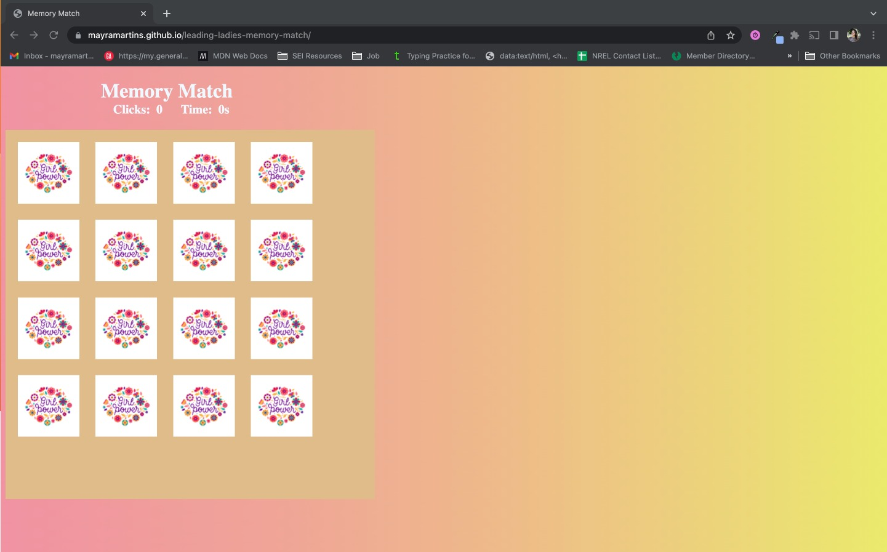
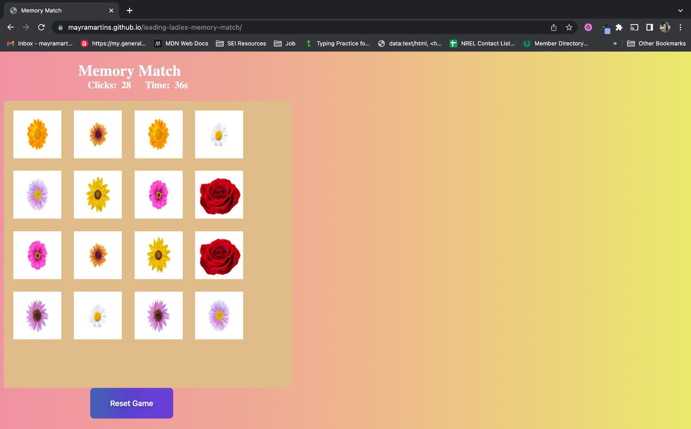

# LEADING LADIES MEMORY MATCH

# GAME INTRO

Welcome to Leading Ladies Memory Match - the game that celebrates women empowerment and the beauty of flowers!

This memory game is not just about matching cards - it brings the grace and resilience of flowers and just as flowers weather storms, women too have endured challenges and adversity, blossoming into forces of nature to be reckoned with. That's why everybody wins!

# INSTRUCTIONS

- The goal of the game is to find all the matching flowers
- The game starts with the board of 16 unrevealed cards
- The player start the game by clicking in any card and the flower is revealed
- The timer starts to counting the seconds
- The number of clicks is displayed on the top
- The logic of the game
- The player finds all the matching cards
- YOU WIN!
- Reset the game and play again

# WIN LOGIC

Everybody wins! The player performance is counted by number of clicks and seconds displayed, so the player can challenge itself by revealing all the flowers within less seconds and # of clicks.

# RULES

As long as you win the flowers, play as many time as you want!

# TECHNOLOGIES USED

- HTML
- CSS
- Javascript

# GETTING STARTED

https://mayramartins.github.io/leading-ladies-memory-match/

# ICEBOX ITENS

1. Ehnace UX Design with CSS
2. Include animation
3. Include music

Leading Leadies Mamory Match - Led by Mayra Martins
